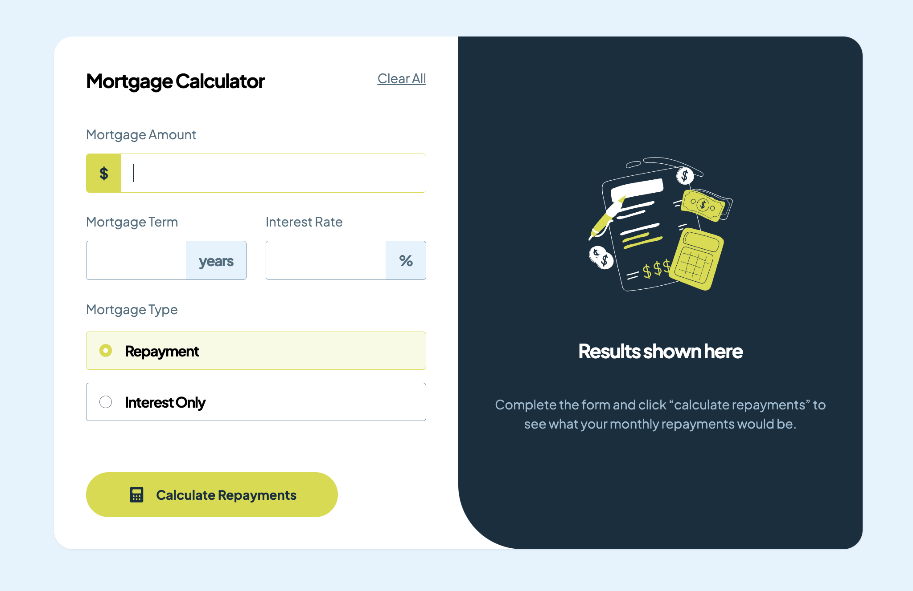

# Frontend Mentor - Mortgage repayment calculator solution

This is a solution to the [Mortgage repayment calculator challenge on Frontend Mentor](https://www.frontendmentor.io/challenges/mortgage-repayment-calculator-Galx1LXK73). Frontend Mentor challenges help you improve your coding skills by building realistic projects.

## Table of contents

- [Overview](#overview)
  - [The challenge](#the-challenge)
  - [Screenshot](#screenshot)
  - [Links](#links)
- [My process](#my-process)
  - [Built with](#built-with)
  - [What I learned](#what-i-learned)
  - [Continued development](#continued-development)

## Overview

### The challenge

Users should be able to:

- Input mortgage information and see monthly repayment and total repayment amounts after submitting the form
- See form validation messages if any field is incomplete
- Complete the form only using their keyboard
- View the optimal layout for the interface depending on their device's screen size
- See hover and focus states for all interactive elements on the page

### Screenshot



### Links

- Solution URL: [https://github.com/solvman/mortgage-repayment-calculator-main](https://github.com/solvman/mortgage-repayment-calculator-main)
- Live Site URL: [https://sparkling-naiad-9be152.netlify.app/](https://sparkling-naiad-9be152.netlify.app/)

## My process

### Built with

- Semantic HTML5 markup
- CSS custom properties
- Flexbox
- CSS Grid
- Mobile-first workflow
- [React](https://reactjs.org/) - JS library
- [Next.js](https://nextjs.org/) - React framework
- [React Hook Form](https://react-hook-form.com//) - Performant, flexible and extensible forms with easy-to-use validation.

### What I learned

I learned how to work with controlled components in React, including how to use the Controller from react-hook-form to manage form state and validation. Specifically, I figured out how to set up validation rules, like required fields and maximum length, and display custom error messages. I also learned to handle value changes with custom formatting functions, such as converting input to currency format, while maintaining proper references and error handling within the input component.

```typescript
<Controller
  name="amount"
  control={control}
  rules={{
    required: ERROR_REQUIRED,
    maxLength: { value: 11, message: "Maximum 9 digits allowed" },
  }}
  render={({ field: { value, onChange, ref } }) => (
    <Input
      ref={ref}
      decoratorLabel="$"
      label="Mortgage Amount"
      type="text"
      value={value as string}
      onChange={(event) => onChange(formatToCurrency(event.target.value))}
      error={errors.amount?.message}
    />
  )}
/>
```

### Continued development

For my future projects, I want to keep focusing on a few key areas. With Tailwind CSS, I aim to get better at keeping styles consistent across different components, exploring custom configurations, and building responsive layouts. In React, I plan to work on creating highly reusable and maintainable components, managing props and state effectively, and applying composition patterns to build complex UIs from simple, reusable components. Lastly, with react-hook-form, I want to enhance my form validation techniques, manage more complex forms, and implement comprehensive error handling and user feedback within forms.
